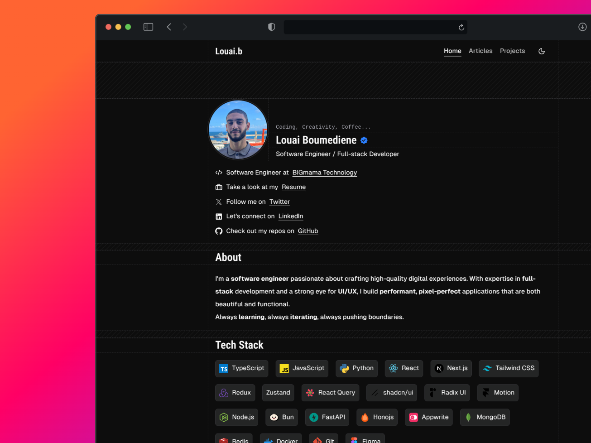

# Minimalistic Portfolio Website

## Overview
This is a sleek, modern, and highly customizable portfolio template built using **Astro**. Designed with performance, accessibility, and SEO in mind, it offers a clean and minimalistic experience while providing all the essential features needed for a professional online presence.

## Features
- 🌙 **Light & Dark Mode** – Seamlessly switch between themes.
- 📱 **Mobile-Friendly** – Fully responsive design.
- 📖 **Blog Section** – Supports **MDX** with automatic table of contents (TOC) and pagination.
- 🏷️ **Categorized Articles** – Filter posts by series or category.
- 🚀 **Projects Showcase** – Detailed overview of projects with images and descriptions.
- 🖼️ **SEO & Open Graph** – Optimized metadata and dynamic OG images.
- 🎨 **Sleek & Modern Design** – Crafted with a focus on simplicity and elegance.

## Tech Stack
Built using the following technologies:

- **Astro** – Blazing fast static site generation.
- **TailwindCSS** – Highly customizable utility-first CSS framework.
- **TypeScript** – Strict type safety for maintainability.
- **Prettier** – Code formatting for consistency.
- **Framer Motion** – Smooth animations and transitions.

## How to Use
Customization is simple and straightforward:

- All customizable data (name, links, content, etc.) is stored in `lib/constants/` dir.
- Images can be replaced in the `public` folder.
- OG images for blogs and projects are stored in `public/og/`.
- Theming follows **shadcn's** color palette and can be easily tweaked.

## Contribute & Support
Love the project? Give it a ⭐ on GitHub! Contributions are always welcome—whether it's fixing a bug, adding a new feature, or even correcting a small typo.

[👉 Check out the repo](https://github.com/Louai-Zokerburg/louai) and make your first pull request!

---

Built with ❤️ using **Astro**.
